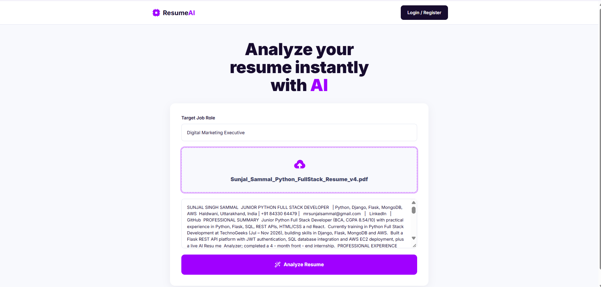
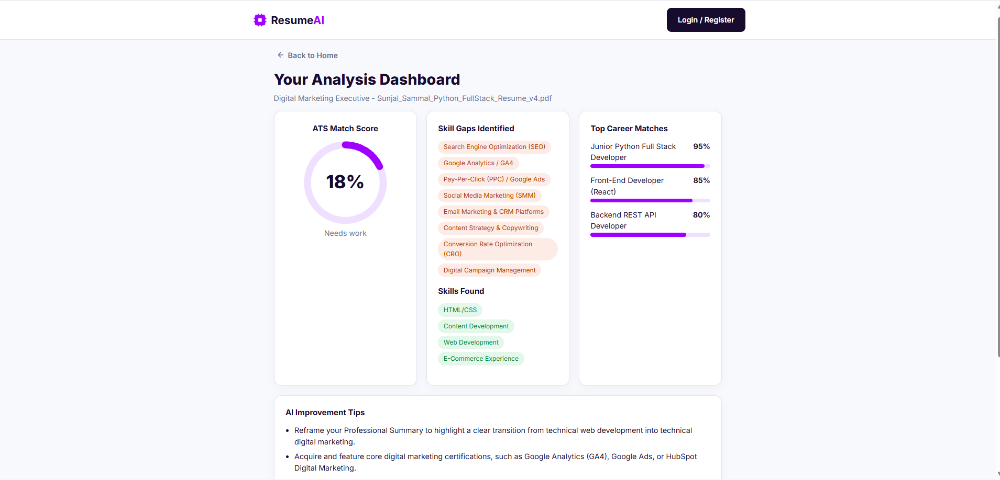
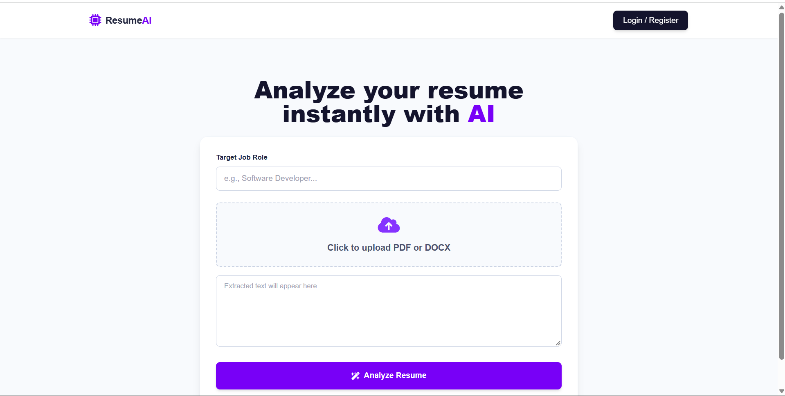
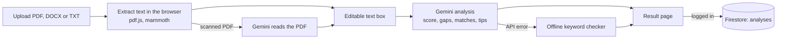

<div align="center">

# ResumeAI: AI Resume Analyzer

**Upload a resume, choose a target job role, and get an ATS match score, skill gaps, career matches and improvement tips in seconds.**

[Live demo](https://resumeanalyzer-9e16f.web.app) · [Report a bug](../../issues) · [Request a feature](../../issues)


</div>

---

## Table of contents

1. [Overview](#overview)
2. [Features](#features)
3. [Screenshots](#screenshots)
4. [Tech stack](#tech-stack)
5. [How it works](#how-it-works)
6. [Project structure](#project-structure)
7. [Getting started](#getting-started)
8. [Environment variables](#environment-variables)
9. [Firebase setup](#firebase-setup)
10. [Gemini API](#gemini-api)
11. [Offline fallback scoring](#offline-fallback-scoring)
12. [Supported job roles](#supported-job-roles)
13. [Deployment](#deployment)
14. [Security and privacy](#security-and-privacy)
15. [Troubleshooting](#troubleshooting)
16. [Customization](#customization)
17. [Limitations and roadmap](#limitations-and-roadmap)
18. [Author](#author)

---

## Overview

Many companies run resumes through Applicant Tracking Systems (ATS) before a person reads them. A resume that is missing the right keywords, sections or measurable results can be filtered out early.

**ResumeAI** helps job seekers check this in advance. The user uploads a resume (PDF, DOCX or TXT) and types the role they are applying for. The app extracts the text, sends it to Google's Gemini model, and shows a results page with:

- an **ATS match score** from 0 to 100,
- the **skills the resume already shows** and the **skill gaps** for that role,
- the **top three career matches** for the resume,
- specific **improvement tips**.

Signed-in users (Google login) also get a **dashboard** with their saved analyses.

> The score is an estimate produced by an AI model. It is not the output of a real ATS and does not guarantee any hiring result.

---

## Features

**Resume input**
- Upload **PDF, DOCX or TXT**. Text is extracted in the browser with `pdf.js` and `mammoth`.
- The extracted text appears in an **editable text box**, so it can be corrected, or a resume can simply be pasted.
- **Scanned PDFs** (no selectable text) are read by Gemini instead.

**Role selection**
- Type **any profession**. Suggestions appear as you type: 18 preset roles (technical and non-technical) plus live **AI suggestions** from Gemini.

**Analysis**
- AI-generated **ATS match score**, **skills found**, **skill gaps**, **top 3 career matches** and **improvement tips**.
- **Offline fallback**: if the AI service fails and the role matches a preset role, a built-in keyword checker produces the score, so the app still works.

**Pages and navigation**
- **Home**: upload, extracted text and analyze.
- **Result page**: shown on a separate page, with **Back to Home** and **Analyze Another Resume** buttons. Home keeps what you typed when you return.
- **Dashboard**: list of previous analyses, click one to reopen it.

**Accounts**
- **Google sign-in** with Firebase Authentication.
- Analyses are saved to **Cloud Firestore** for logged-in users. Guests can analyze without logging in.

**UI**
- Centered, responsive layout that works on desktop and mobile.

---

## Screenshots

### Home Page


### Analysis Results


### Dashboard


## Tech stack

| Area | Technology |
| --- | --- |
| Frontend | React 18, Vite 5, plain CSS |
| Authentication | Firebase Authentication (Google provider) |
| Database | Cloud Firestore |
| Hosting | Firebase Hosting |
| AI | Google Gemini API (REST, JSON mode) |
| File parsing | `pdfjs-dist` (PDF), `mammoth` (DOCX) |

---

## How it works



1. **Extract.** `readFile()` in `src/analyze.js` reads the file. PDFs go through `pdf.js`, DOCX through `mammoth`, TXT is read directly. If a PDF has almost no text, `aiExtract()` in `src/gemini.js` asks Gemini to read it.
2. **Choose a role.** The role box (`RoleInput` in `src/App.jsx`) merges matching preset roles with AI suggestions. Suggestion requests are debounced (600 ms) and start after three characters.
3. **Analyze.** `aiAnalyze()` sends the resume text and role to Gemini and asks for strict JSON. The response is normalized: scores are clamped to 0-100, lists are coerced to arrays, and career matches are limited to three.
4. **Fall back if needed.** If the API call fails, `findRole()` maps the typed role to the closest preset role and `analyze()` scores the resume locally. The result page tells the user the offline checker was used.
5. **Show and save.** The result opens on its own page. For logged-in users the result (not the resume text) is written to Firestore.

Navigation is state-based (`home`, `result`, `dashboard`) instead of a router, which keeps the code short. The Home page stays mounted while hidden, so the form is intact when the user comes back.

---

## Project structure

```
resume-analyzer/
├── docs/
│   └── home.png            # README screenshot
├── src/
│   ├── main.jsx            # React entry point
│   ├── App.jsx             # Header, Home, Result, Dashboard, Google login, role suggestions
│   ├── firebase.js         # Firebase init (reads .env)
│   ├── gemini.js           # Gemini calls: aiAnalyze, aiExtract, suggestRoles
│   ├── analyze.js          # File reading, offline scoring, findRole
│   ├── roles.js            # Preset roles and their key skills
│   └── index.css           # All styles (CSS variables at the top)
├── index.html
├── package.json
├── vite.config.js
├── firebase.json           # Hosting config (serves dist, SPA rewrite)
├── .firebaserc             # Default Firebase project
├── .env.example            # Template for your local .env
└── .gitignore              # Ignores node_modules, dist and .env
```

---

## Getting started

### Prerequisites

- **Node.js 18 or newer** and npm
- A **Firebase project** (the free Spark plan is enough for development)
- A **Gemini API key** from [Google AI Studio](https://aistudio.google.com/apikey)

### Installation

```bash
# 1. Clone the repository
git clone https://github.com/<your-username>/resume-analyzer.git
cd resume-analyzer

# 2. Install dependencies
npm install

# 3. Create your local environment file
cp .env.example .env          # Windows: copy .env.example .env
```

Open `.env`, fill in the values (see [Environment variables](#environment-variables)), then finish the [Firebase setup](#firebase-setup) and start the app:

```bash
npm run dev
```

Open **http://localhost:5173**. Use `localhost`, not `127.0.0.1`, or Google sign-in will be rejected.

### Scripts

| Command | What it does |
| --- | --- |
| `npm run dev` | Starts the dev server with hot reload |
| `npm run build` | Creates the production build in `dist/` |
| `npm run preview` | Serves the production build locally |

---

## Environment variables

Vite reads a file named exactly **`.env`** (not `.env.example`). The repository contains only the blank template `.env.example`. Your real `.env` is git-ignored and never uploaded.

| Variable | Where to find it |
| --- | --- |
| `VITE_FIREBASE_API_KEY` | Firebase console > Project settings > Your apps > Web app > Config. Starts with `AIza` |
| `VITE_FIREBASE_AUTH_DOMAIN` | Same place. Usually `<project-id>.firebaseapp.com` |
| `VITE_FIREBASE_PROJECT_ID` | Same place |
| `VITE_FIREBASE_APP_ID` | Same place. Looks like `1:1234567890:web:abcdef` |
| `VITE_GEMINI_API_KEY` | [Google AI Studio](https://aistudio.google.com/apikey) |

Rules for the `.env` file:

- No quotes and no spaces around the values.
- It must sit next to `package.json`.
- **Restart `npm run dev` after every change.** Vite only reads it at startup.
- On Windows, make sure the file is not saved as `.env.txt`.

---

## Firebase setup

In the [Firebase console](https://console.firebase.google.com):

1. **Register a web app** (Project settings > Your apps) and copy its config into `.env`.
2. **Authentication**: Sign-in method > enable **Google** and choose a support email. `localhost` and your `*.web.app` domain are authorized by default. Add any custom domain under Authentication > Settings > Authorized domains.
3. **Firestore Database**: create a database, then publish these security rules so each user can only create and read their own analyses:

```
rules_version = '2';
service cloud.firestore {
  match /databases/{db}/documents {
    match /analyses/{id} {
      allow create: if request.auth != null && request.resource.data.uid == request.auth.uid;
      allow read: if request.auth != null && resource.data.uid == request.auth.uid;
    }
  }
}
```

### Data model

Each saved analysis is one document in the `analyses` collection. The resume text itself is **not** stored.

```json
{
  "uid": "firebase-user-id",
  "role": "Python Developer",
  "fileName": "resume.pdf",
  "score": 72,
  "found": ["python", "django", "sql"],
  "missing": ["docker", "pytest"],
  "matches": [{ "name": "Backend Developer", "pct": 78 }],
  "tips": ["Add measurable results, for example: improved page speed by 30%."],
  "note": "Only present when the offline checker was used.",
  "createdAt": "<server timestamp>"
}
```

---

## Gemini API

All AI calls live in `src/gemini.js` and use the REST endpoint directly:

```
POST https://generativelanguage.googleapis.com/v1beta/models/{MODEL}:generateContent
x-goog-api-key: <VITE_GEMINI_API_KEY>
generationConfig.responseMimeType: application/json
```

| Function | Purpose |
| --- | --- |
| `aiAnalyze(text, role)` | Scores the resume for the role and returns structured JSON |
| `aiExtract(file)` | Reads a scanned PDF and returns its text |
| `suggestRoles(text)` | Returns job-title suggestions for what the user is typing |

The model name is a single constant at the top of the file (`MODEL`). Change it if Google retires the current one.

Expected analysis response:

```json
{
  "score": 72,
  "found": ["python", "django"],
  "missing": ["docker", "pytest"],
  "matches": [{ "name": "Backend Developer", "pct": 78 }],
  "tips": ["Add a Projects section with 2-3 relevant projects."]
}
```

---

## Offline fallback scoring

When the AI service is unavailable, `analyze()` in `src/analyze.js` computes the score locally:

**Score = 70% skills match + 30% resume quality**

- **Skills match (70 points):** the share of the role's key skills found in the resume, using whole-word matching (so `java` does not match `javascript`).
- **Resume quality (30 points):**

| Check | Points |
| --- | --- |
| Email address present | 5 |
| Experience or internship section | 5 |
| Projects section | 5 |
| Education section | 4 |
| Phone number present | 3 |
| Summary or objective | 3 |
| Measurable results (percentages, numbers, users, clients) | 3 |
| Length between 200 and 900 words | 2 |

Top career matches are the three preset roles with the highest skill overlap. Tips are generated from the failed checks and the missing skills.

---

## Supported job roles

The preset list powers the suggestions and the offline fallback. The AI analysis works for **any** role the user types.

**Technical**: Python Developer, MERN Stack Developer, Frontend Developer, Java Backend Developer, Mobile App Developer, Data Analyst, Data Scientist / ML Engineer, DevOps / Cloud Engineer, UI/UX Designer, Cybersecurity Analyst, QA / Test Engineer

**Non-technical**: Digital Marketing Executive, HR / Recruiter, Sales & Business Development, Content Writer, Accountant / Finance, Project / Product Manager, Operations / Customer Support

---

## Deployment

The project is set up for Firebase Hosting (`firebase.json` serves `dist/` with a single-page-app rewrite).

```bash
npm run build
npx firebase-tools login
npx firebase-tools deploy --only hosting
```

`.firebaserc` points to the default project. Change it if you use a different Firebase project.

Vite bakes the `.env` values into the build, so run `npm run build` on a machine that has your `.env`.

---

## Security and privacy

- **Firebase web config is not a secret.** Access is controlled by Authentication and the Firestore rules above.
- **The Gemini key is visible in the browser.** Any key used in client-side code can be read from the built JavaScript. Reduce the risk: in Google Cloud Console > Credentials, restrict the key to your website URLs (HTTP referrers) and to the Generative Language API, and set a quota.
- **For production**, move the Gemini calls behind a server, such as a Firebase Cloud Function, or use Firebase AI Logic with App Check, so the key never reaches the browser.
- **Never commit `.env`.** It is already in `.gitignore`. If you upload files through the GitHub website instead of git, leave `.env` out by hand.
- **Resume privacy.** Resume text is processed in the browser and sent to the Gemini API for analysis. It is not saved to Firestore. Review Google's Gemini API terms for how submitted content is handled before using real resumes at scale.

---

## Troubleshooting

| Symptom | Cause | Fix |
| --- | --- | --- |
| `auth/invalid-api-key` or "Firebase config missing or wrong" | `.env` is missing, misnamed, empty, or the dev server was not restarted. An `appId` pasted into the API key field also triggers it | Create `.env` from `.env.example`, check each value, restart `npm run dev` |
| `auth/unauthorized-domain` on login | App opened on `127.0.0.1` or an unlisted domain | Use `http://localhost:5173` or add the domain under Authentication > Settings > Authorized domains |
| `auth/operation-not-allowed` | Google provider is not enabled | Authentication > Sign-in method > Google > Enable |
| Login popup does not open | Browser blocked the popup | Allow popups for the site |
| Result says "The AI service was unavailable" | Missing or invalid `VITE_GEMINI_API_KEY`, quota reached, key restrictions, or the model name was retired | Check the key and its restrictions, check quota, update `MODEL` in `src/gemini.js` |
| "Missing or insufficient permissions" when saving or opening the dashboard | Firestore rules not published | Publish the rules from [Firebase setup](#firebase-setup) |
| "Could not read text from this file" | Scanned PDF with no text and no working Gemini key | Add the Gemini key, or paste the resume text into the text box |
| Console shows `runtime.lastError: The message port closed` | A browser extension, unrelated to this app | Ignore it |

---

## Customization

- **Add or edit a role:** in `src/roles.js`, add a line such as `tech("id", "Role Name", ["skill one", "skill two"])` or `non(...)`. List skills in lowercase, most important first.
- **Change the AI model:** edit `MODEL` in `src/gemini.js`.
- **Change the look:** edit the CSS variables at the top of `src/index.css` (`--brand`, `--ink`, `--bg`).
- **Tune offline scoring:** edit the `CHECKS` array and the 70/30 split in `src/analyze.js`.

---

## Limitations and roadmap

**Current limitations**

- The score is an AI estimate and can vary slightly between runs.
- The Gemini key is used from the browser (see [Security and privacy](#security-and-privacy)).
- The offline fallback only supports the preset roles.
- There are no automated tests yet.
- Navigation is state-based, so pages do not have their own URLs and the browser back button leaves the app.

**Roadmap**

- [ ] Move Gemini calls to a Cloud Function and add rate limiting
- [ ] Add React Router so each page has its own URL
- [ ] Compare a resume against a pasted job description
- [ ] Export the analysis as a PDF report
- [ ] Delete saved analyses from the dashboard
- [ ] Add unit tests for the scoring logic and role matching
- [ ] Dark mode

Issues and pull requests are welcome.

---

## Author

**[Sunjal Singh Sammal]**

- GitHub: [sunjal21](https://github.com/sunjal21)
- LinkedIn: [Sunjal Singh Sammal](https://www.linkedin.com/in/sunjal-sammal/)
- Live project: [resumeanalyzer-e5fef.web.app](https://resumeanalyzer-9e16f.web.app)
